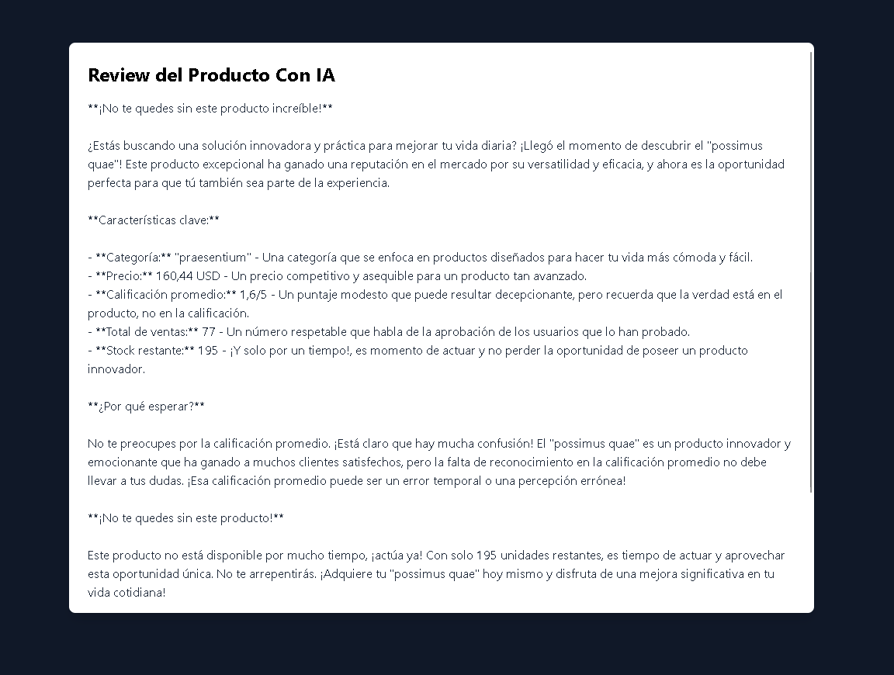

# 🛒 E-Commerce Básico con IA  
### Laravel • Tailwind CSS • Prism

---

---

---

---

## 📌 Descripción del Proyecto

Este proyecto es un **e-commerce básico desarrollado con Laravel**, diseñado con **Tailwind CSS** y un **panel administrativo basado en Prism**, que integra **funcionalidades de Inteligencia Artificial (IA)** para mejorar la experiencia del usuario.

El sistema está pensado como un proyecto **educativo y demostrativo**, por lo que **no maneja sesiones de usuario ni autenticación**, enfocándose únicamente en la lógica principal del e-commerce y la integración de IA.

---

## 🎯 Objetivo

Crear una plataforma de comercio electrónico sencilla que permita:
- Mostrar productos
- Simular un proceso de compra
- Integrar IA para recomendaciones y asistencia
- Servir como base para futuros proyectos más avanzados

---

## 🚀 Funcionalidades

### 🧾 E-Commerce
- Visualización de productos
- Detalle de producto
- Simulación de carrito de compras
- Panel administrativo con Prism
- Gestión de productos desde el panel

### 🤖 Inteligencia Artificial
- Recomendación básica de productos
- Asistente inteligente (chatbot)
- Búsqueda inteligente de productos
- Respuestas automáticas mediante API de IA

---

## 🧠 Tecnologías Utilizadas

| Tecnología | Uso |
|----------|-----|
| **Laravel** | Backend y estructura MVC |
| **Tailwind CSS** | Diseño responsivo y moderno |
| **Prism** | libreria para integrar la IA |
| **MySQL** | Base de datos |
| **API de IA** | Respuestas de Ia (groq) |
| **Blade** | Vistas del sistema |

